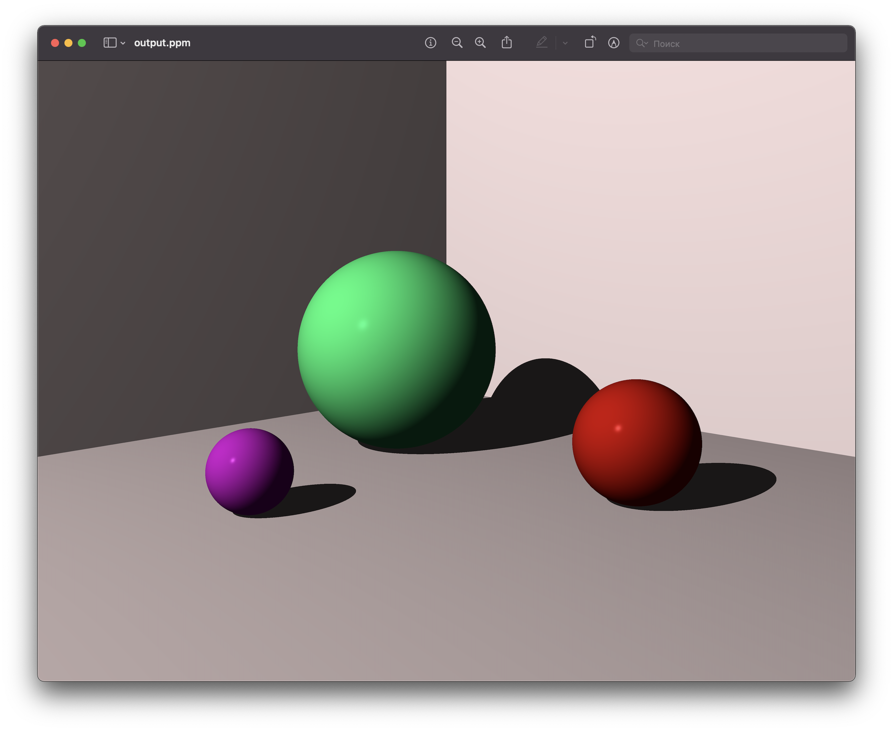
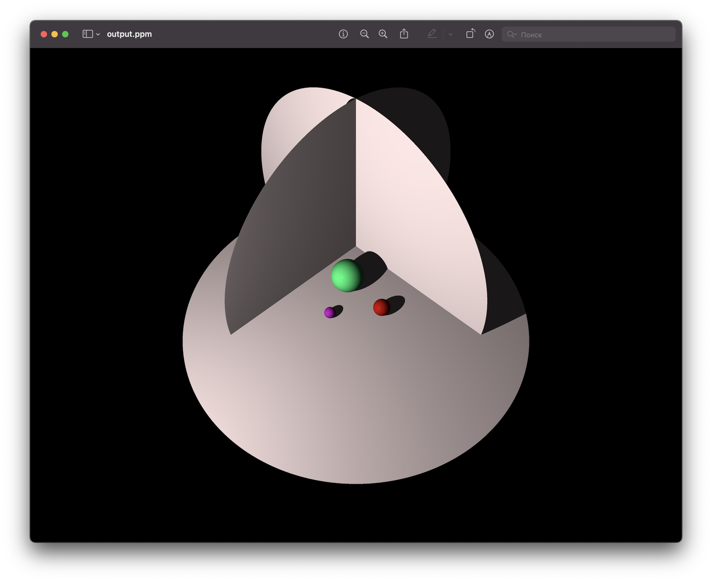

# Ray tracer

Ray tracer written on Rust, based on the book ["The Ray Tracer Challenge" by Jamis Buck](http://www.raytracerchallenge.com/).

## What can the ray tracer do currently?

For now it can render scene using virtual "world" and camera into .ppm image format. World can hold one light source and any number of graphic primitives.

You can apply various transformations and material settings to the object. All of these factors will affect the final pixel color in the final picture.

### Available graphic primitives

- Spheres

### Examples of rendered scenes

## Progress in the book

- [x] Chapter 01: Tuples, Points, and Vectors
- [x] Chapter 02: Drawing on a Canvas
- [x] Chapter 03: Matrices
- [x] Chapter 04: Matrix Transformations
- [x] Chapter 05: Ray-Sphere Intersections
- [x] Chapter 06: Light and Shading
- [x] Chapter 07: Making a Scene
- [x] Chapter 08: Shadows
- [ ] Chapter 09: Planes
- [ ] Chapter 10: Patterns
- [ ] Chapter 11: Reflection and Refraction
- [ ] Chapter 12: Cubes
- [ ] Chapter 13: Cylinders
- [ ] Chapter 14: Groups
- [ ] Chapter 15: Triangles
- [ ] Chapter 15: Constructive Solid Geometry (CSG)
